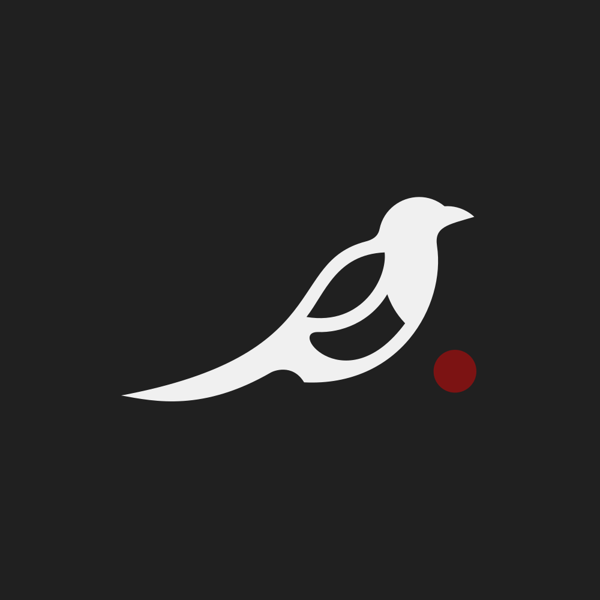

# jazz magpie

Logo and trademarks for me and products made by me (Błażej Sewera - jazz)

Logo is free to use provided that it leads to, or is direcly connected to me (jazz) or products associated with me.

The purpose of the "jazz" name is to associate an easy-to-remember name with Błażej Sewera.

The purpose of the "magpie" name is to associate a name with products made by me.

Usage of "jazz" and "magpie" in your trademarks is not prohibited, as long as it is not purposely used to make confusion with my brand, these words are commonly used. However, I insist that "jazz magpie" and "magpie jazz" are not used anywhere else, as these are to be trademarks associated with me. Also, it would be very kind of you if you chose not to use "magpie" in your products.

The origin of the name jazz came from secondary school, as this was my nickname at the time.

The origin of the name magpie came from my fascination with these birds - spieces: Pica pica.

> As always, made with <3 by jazz
